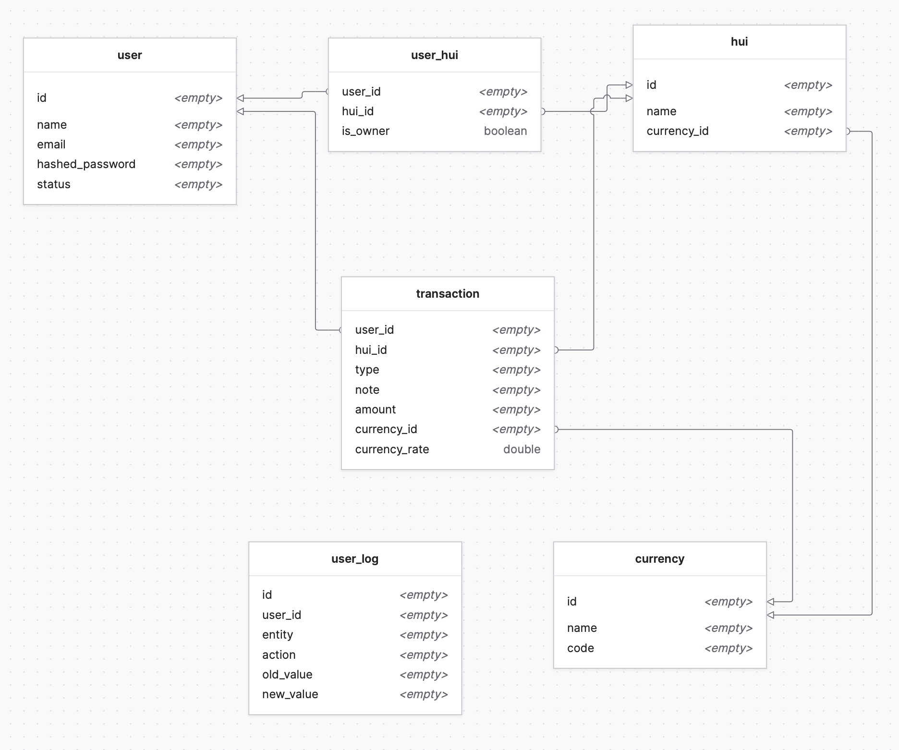

# Hui

To start your Phoenix server:

  * Install dependencies with `mix deps.get`
  * Create and migrate your database with `mix ecto.setup`
  * Start Phoenix endpoint with `mix phx.server`

Now you can visit [`localhost:4000`](http://localhost:4000) from your browser.

Ready to run in production? Please [check our deployment guides](https://hexdocs.pm/phoenix/deployment.html).
### Features

- [x] Auth: `api/auth`
  - [x] Sign up by phone, email `/sign-up`
  - [x] Log in `/login`
  - [ ] Forgot password `forgot`
  - [ ] Update password by token `reset` with token
- [x] me `/me`
- [x] update profile `/me`
- [ ] Hui
  - [x] Init Hui
  - [x] Hui list with status `active`, `awaiting`, `left`
  - [x] Invite member
  - [ ] Confirm join
  - [ ] Leave Hui
  - [ ] Transfer Admin
- [ ] Member
  - [x] active list `/hui/{hui_id}/members`
- [ ] Bill
  - [ ] Make a bill and split for members(all, selected members, a member)
- [ ] Balance
  - [ ] Check balance
  - [ ] Deposit
  - [ ] Withdraw
  - [ ] Transfer
- [ ] Transaction

### db diagram
